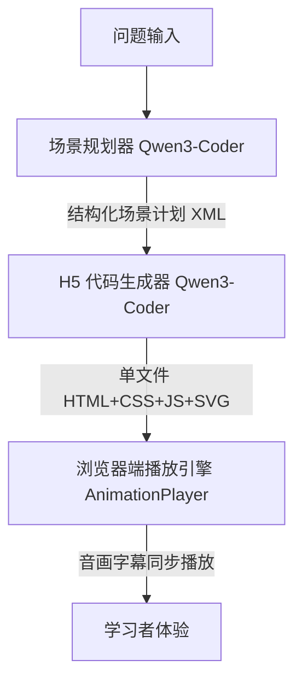

# Study11.ai: 大模型驱动的个性化讲解动画平台

[](https://www.study11.ai/)
[](https://preview.study11.ai/)
[](https://github.com/litongjava/study11-backend)

---

## 📖 项目简介

**Study11.ai** 是一个基于 **国产大模型 Qwen3-Coder** 的智能化学习平台，核心目标是将学生输入的问题转化为 **结构化可视化讲解动画**。
平台面向中学理科与大学通识课程，支持 **多模态（动效 + 语音 + 字幕）讲解**，并结合学习画像与知识图谱给出个性化学习路径。

> **一句话总结**：从 *学生问题* → *场景规划* → *H5 动画生成* → *音画字幕同步* → *学习路径推荐* 的端到端闭环系统。

---

## 🚀 在线体验

* 学生端体验入口 👉 [https://www.study11.ai/](https://www.study11.ai/)
* 动画生成预览 👉 [https://preview.study11.ai/](https://preview.study11.ai/)
* 示例（动量守恒定律） 👉 [https://preview.study11.ai/preview/547805514723590144](https://preview.study11.ai/preview/547805514723590144)
* 什么是SVG👉  [https://preview.study11.ai/preview/549231403875368960](https://preview.study11.ai/preview/549231403875368960)

---

## 🏗️ 系统架构



* **场景规划器**：生成带有字幕、TTS 切分点、动画元素的结构化多场景计划
* **H5 生成器**：依据严格约束输出单文件 HTML（SVG 动画 + 控制条 + 公共模块）
* **播放引擎**：支持字幕渲染、音画同步、缓存优化、交互控制
* **个性化推荐**：基于学习画像与知识图谱动态规划学习路径

---

## ⚙️ 核心功能

1. **自动场景规划**

   * 输入：主题（如“动量守恒定律”）
   * 输出：多场景结构化计划（标题、描述、字幕、公式、动画元素）

2. **可控 H5 动画生成**

   * 输出单文件 HTML
   * 严格遵循 UI/交互约束（如 `<text x="800">`、公共样式/模块引用）

3. **音画字幕同步播放**

   * 首次点击触发 TTS 合成
   * Cache Storage/IndexedDB 本地缓存
   * 支持字幕逐字/逐句同步

4. **自动化质量校验**

   * DOM 约束检查
   * Puppeteer 截图对比
   * 自动交互测试（播放/暂停/拖拽）
   * 字幕与音频时长误差检测

---

## 🧪 教育案例

**动量守恒定律**（中学物理典型案例）：

* **SCENE_1**：动量概念引入 (p=mv, 矢量箭头对比)
* **SCENE_2**：冲量与动量定理 (Δp=FΔt, 时间轴演示)
* **SCENE_3**：守恒定律推导 (牛顿第三定律 → 系统总动量不变)
* **SCENE_4**：一维碰撞实例 (弹性/非弹性，动画验证)
* **SCENE_5**：爆炸与反冲 (火箭推进、碎片飞散)

👉 [案例预览](https://preview.study11.ai/preview/547805514723590144)

---

## 🖥️ 技术栈

### 模型

* **主模型**：Qwen3-Coder（代码生成与结构化文本输出）
* **辅助模型**：小参数蒸馏版（个性化路径推荐重排）

### 软件

* 自研 **tio-boot** 框架
* 前端播放引擎：AnimationPlayer
* Playwright（可视化回归测试）

### 硬件

* 部署平台：阿里云百炼

---

## 📊 性能数据

| 阶段     | 耗时 (秒) |
| ------ | ------ |
| 场景规划   |  10   |
| 动画生成   | 60   |
| TTS 合成 | 20   |

---

## 📂 开源地址

* Backend 源码：[https://github.com/litongjava/study11-backend](https://github.com/litongjava/study11-backend)

## 📚 使用指南

### 基础用法

#### 1. 创建简单场景

```javascript
const allScenes = [
    {
        title: "三角函数简介",
        subtitle: "三角函数描述了直角三角形中角度与边长的关系",
        action: () => showScene(1, "三角函数简介")
    }
];
```

#### 2. 添加 SVG 场景

```javascript
{
    title: "单位圆",
    subtitle: "单位圆是半径为 1 的圆",
    action: () => {
        // 显示 SVG 场景
        showScene(2, "单位圆");
    }
}
```

#### 3. 添加 Three.js 3D 场景

```javascript
{
    title: "3D 立方体",
    subtitle: "使用 Three.js 展示 3D 效果",
    is3D: true,
    canvasId: 'canvas3d',
    
    setup3D: (setup) => {
        const geometry = new THREE.BoxGeometry(2, 2, 2);
        const material = new THREE.MeshPhongMaterial({ color: 0x3498db });
        const cube = new THREE.Mesh(geometry, material);
        setup.scene.add(cube);
        setup.objects.cube = cube;
    },
    
    animate3D: (setup) => {
        setup.objects.cube.rotation.x += 0.01;
        setup.objects.cube.rotation.y += 0.01;
    },
    
    action: () => showScene(7, "3D 立方体")
}
```

#### 4. 添加 P5.js 动画场景

```javascript
{
    title: "动态正弦波",
    subtitle: "使用 P5.js 创建动态动画",
    isP5: true,
    containerId: 'p5Container',
    
    setupP5: (p) => {
        let angle = 0;
        
        p.setup = () => {
            p.createCanvas(800, 400);
        };
        
        p.draw = () => {
            p.background(245);
            
            // 绘制正弦波
            p.beginShape();
            for (let x = 0; x < p.width; x += 5) {
                let y = p.sin(x * 0.02 + angle) * 50;
                p.vertex(x, p.height/2 + y);
            }
            p.endShape();
            
            angle += 0.05;
        };
    },
    
    action: () => showScene(9, "动态正弦波")
}
```

#### 5. 添加 JSXGraph 交互场景

```javascript
{
    title: "交互式函数",
    subtitle: "拖动滑块改变函数参数",
    isJSXGraph: true,
    containerId: 'jsxgraphContainer',
    
    setupJSXGraph: (board) => {
        // 创建滑块
        const amplitude = board.create('slider', 
            [[1, 4], [6, 4], [0.5, 1, 3]], 
            { name: '振幅' }
        );
        
        // 创建函数
        board.create('functiongraph', [
            function(x) {
                return amplitude.Value() * Math.sin(x);
            },
            -2*Math.PI, 2*Math.PI
        ], {
            strokeColor: '#e74c3c',
            strokeWidth: 3
        });
    },
    
    action: () => showScene(10, "交互式函数")
}
```

#### 6. 添加 Desmos 场景

```javascript
{
    title: "Desmos 图形计算器",
    subtitle: "强大而美观的数学工具",
    isDesmos: true,
    containerId: 'desmosContainer',
    
    setupDesmos: (calculator) => {
        // 设置函数
        calculator.setExpression({
            id: 'sin',
            latex: 'y=\\sin(x)',
            color: Desmos.Colors.RED
        });
        
        // 添加滑块
        calculator.setExpression({
            id: 'a',
            latex: 'a=1',
            sliderBounds: { min: 0, max: 3 }
        });
        
        // 参数化函数
        calculator.setExpression({
            id: 'param',
            latex: 'y=a\\sin(x)',
            color: Desmos.Colors.BLUE
        });
    },
    
    action: () => showScene(11, "Desmos 计算器")
}
```

### 初始化播放器

```javascript
async function initializePlayer() {
    const elements = {
        audioContainer: document.getElementById('audioContainer'),
        loading: document.getElementById('loading'),
        playBtn: document.getElementById('playBtn'),
        playIcon: document.getElementById('playIcon'),
        muteBtn: document.getElementById('muteBtn'),
        muteIcon: document.getElementById('muteIcon'),
        progressBar: document.getElementById('progressBar'),
        progressFill: document.getElementById('progressFill'),
        progressHandle: document.getElementById('progressHandle'),
        subtitle: document.getElementById('subtitle'),
        timeDisplay: document.getElementById('timeDisplay'),
        cacheIndicator: document.getElementById('cacheIndicator')
    };

    // 使用 AnimationPlayerComplete 支持所有工具
    const player = new AnimationUtils.AnimationPlayerComplete({
        scenes: allScenes,
        elements: elements,
    });

    await player.init();
    player.setSceneButtons(document.getElementById('sceneButtons'));
    
    // 预加载音频
    await player.preloadAllAudio((current, total) => {
        console.log(`加载进度: ${current}/${total}`);
    });
    
    // 自动播放
    await player.playWithErrorHandling();
    
    // 暴露到全局供调试
    window.mathPlayer = player;
}

document.addEventListener('DOMContentLoaded', initializePlayer);
```

---

## 🎨 高级功能

### 自定义样式

```css
/* 修改主题颜色 */
.control-btn {
    background: #e74c3c;  /* 自定义按钮颜色 */
}

.subtitle {
    font-size: 1.6rem;    /* 调整字幕大小 */
    color: #2c3e50;
}

/* 响应式设计 */
@media (max-width: 768px) {
    .subtitle {
        font-size: 1.2rem;
    }
}
```

### 自定义 TTS API

```javascript
const player = new AnimationUtils.AnimationPlayerComplete({
    scenes: allScenes,
    elements: elements,
    apiUrl: 'https://your-tts-api.com/synthesize?text='  // 自定义 API
});
```

### 场景生命周期钩子

```javascript
{
    title: "高级场景",
    
    // 场景进入时
    action: () => {
        console.log('场景开始');
        showScene(1, "高级场景");
    },
    
    // 场景退出时（需要自定义实现）
    onExit: () => {
        console.log('场景结束');
        // 清理资源
    }
}
```

---

## 🔧 API 参考

### AnimationPlayerComplete

主播放器类，支持所有可视化工具。

#### 构造函数

```javascript
new AnimationPlayerComplete({
    scenes: Array,      // 场景数组
    elements: Object,   // DOM 元素引用
    apiUrl: String      // TTS API 地址（可选）
})
```

#### 方法

| 方法 | 参数 | 描述 |
|------|------|------|
| `init()` | - | 初始化播放器 |
| `play()` | - | 开始播放 |
| `pause()` | - | 暂停播放 |
| `stop()` | - | 停止播放 |
| `switchToScene(index)` | `index: Number` | 切换到指定场景 |
| `jumpToScene(index, offset)` | `index: Number, offset: Number` | 跳转到场景并指定偏移 |
| `toggleMute()` | - | 切换静音状态 |
| `destroy()` | - | 销毁播放器，清理资源 |

### 场景配置对象

```typescript
interface Scene {
    title: string;              // 场景标题
    subtitle: string;           // 字幕文本
    duration?: number;          // 场景时长（毫秒），自动从音频获取
    action: () => void;         // 场景动作函数
    
    // Three.js 场景
    is3D?: boolean;
    canvasId?: string;
    setup3D?: (setup) => void;
    animate3D?: (setup) => void;
    
    // GeoGebra 场景
    isGeoGebra?: boolean;
    setupGeoGebra?: () => void;
    
    // P5.js 场景
    isP5?: boolean;
    containerId?: string;
    setupP5?: (p) => void;
    
    // JSXGraph 场景
    isJSXGraph?: boolean;
    setupJSXGraph?: (board) => void;
    
    // Desmos 场景
    isDesmos?: boolean;
    setupDesmos?: (calculator) => void;
}
```
---

## 📜 许可协议

本项目遵循 **MIT License**，欢迎二次开发与教学应用。


## 🌟 致谢

### 技术栈

- [Three.js](https://threejs.org/) - 3D 图形库
- [GeoGebra](https://www.geogebra.org/) - 动态数学软件
- [P5.js](https://p5js.org/) - 创意编程库
- [JSXGraph](https://jsxgraph.org/) - 交互式几何库
- [Desmos](https://www.desmos.com/) - 图形计算器

### 贡献者

感谢所有为 Study11 做出贡献的开发者！

<a href="https://github.com/yourusername/study11/graphs/contributors">
  
</a>


---

## 📞 联系我们

- **官网:** [https://study11.ai](https://study11.ai)
---

## 🗺️ 路线图

### v1.0.0 (当前版本)
- ✅ 支持 6 种可视化工具
- ✅ 音频同步和缓存
- ✅ 响应式设计
- ✅ 场景管理系统

### v1.1.0 (计划中)
- 🔜 场景编辑器 GUI
- 🔜 导出为视频功能
- 🔜 多语言支持
- 🔜 更多内置课程模板

### v2.0.0 (未来)
- 🔮 AI 自动生成场景
- 🔮 协作编辑功能
- 🔮 云端存储课程
- 🔮 学生学习分析

---

## 📊 项目统计


---

<div align="center">

**让数学可视化，让学习更有趣**

Made with ❤️ by [Study11 Lab](https://study11.ai)