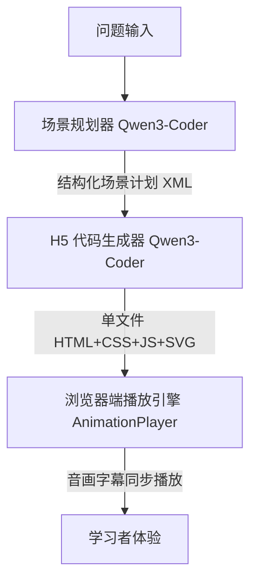

# Study11.ai: 大模型驱动的个性化讲解动画平台

---

## 📖 项目简介

**Study11.ai** 是一个基于 **国产大模型 Qwen3-Coder** 的智能化学习平台，核心目标是将学生输入的问题转化为 **结构化可视化讲解动画**。
平台面向中学理科与大学通识课程，支持 **多模态（动效 + 语音 + 字幕）讲解**，并结合学习画像与知识图谱给出个性化学习路径。

> **一句话总结**：从 *学生问题* → *场景规划* → *H5 动画生成* → *音画字幕同步* → *学习路径推荐* 的端到端闭环系统。

---

## 🚀 在线体验

* 学生端体验入口 👉 [https://www.study11.ai/](https://www.study11.ai/)
* 动画生成预览 👉 [https://preview.study11.ai/](https://preview.study11.ai/)
* 示例（动量守恒定律） 👉 [https://preview.study11.ai/preview/547805514723590144](https://preview.study11.ai/preview/547805514723590144)
* 什么是SVG👉  [https://preview.study11.ai/preview/549231403875368960](https://preview.study11.ai/preview/549231403875368960)

---

## 🏗️ 系统架构

* **场景规划器**：生成带有字幕、TTS 切分点、动画元素的结构化多场景计划
* **H5 生成器**：依据严格约束输出单文件 HTML（SVG 动画 + 控制条 + 公共模块）
* **播放引擎**：支持字幕渲染、音画同步、缓存优化、交互控制
* **个性化推荐**：基于学习画像与知识图谱动态规划学习路径

---

## ⚙️ 核心功能

1. **自动场景规划**

   * 输入：主题（如“动量守恒定律”）
   * 输出：多场景结构化计划（标题、描述、字幕、公式、动画元素）

2. **可控 H5 动画生成**

   * 输出单文件 HTML
   * 严格遵循 UI/交互约束（如 `<text x="800">`、公共样式/模块引用）

3. **音画字幕同步播放**

   * 首次点击触发 TTS 合成
   * Cache Storage/IndexedDB 本地缓存
   * 支持字幕逐字/逐句同步

4. **自动化质量校验**

   * DOM 约束检查
   * Puppeteer 截图对比
   * 自动交互测试（播放/暂停/拖拽）
   * 字幕与音频时长误差检测

---

## 🧪 教育案例

**动量守恒定律**（中学物理典型案例）：

* **SCENE_1**：动量概念引入 (p=mv, 矢量箭头对比)
* **SCENE_2**：冲量与动量定理 (Δp=FΔt, 时间轴演示)
* **SCENE_3**：守恒定律推导 (牛顿第三定律 → 系统总动量不变)
* **SCENE_4**：一维碰撞实例 (弹性/非弹性，动画验证)
* **SCENE_5**：爆炸与反冲 (火箭推进、碎片飞散)

👉 [案例预览](https://preview.study11.ai/preview/547805514723590144)

---

## 🖥️ 技术栈

### 模型

* **主模型**：Qwen3-Coder（代码生成与结构化文本输出）
* **辅助模型**：小参数蒸馏版（个性化路径推荐重排）

### 软件

* 自研 **tio-boot** 框架
* 前端播放引擎：AnimationPlayer
* Playwright（可视化回归测试）

### 硬件

* 部署平台：阿里云百炼

---

## 📊 性能数据

| 阶段     | 耗时 (秒) |
| ------ | ------ |
| 场景规划   |  10   |
| 动画生成   | 60   |
| TTS 合成 | 20   |

---

## 📂 开源地址

* Backend 源码：[https://github.com/litongjava/study11-backend](https://github.com/litongjava/study11-backend)

---

## 📜 许可协议

本项目遵循 **MIT License**，欢迎二次开发与教学应用。
